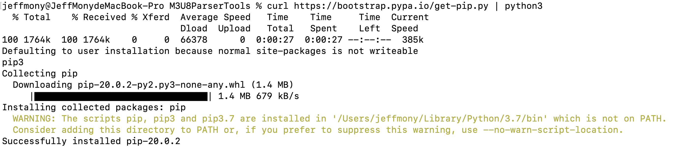

# M3U8ParserTools

python是一个强大的工具，我们可以用python来帮忙处理很多能流程化完成的东西。

> * python 解析xlsx 文件
> * python 归类url类型
> * python 解析M3U8文件

#### MAC 上工具安装
mac上要想完成上面的工作，首先需要安装homebrew，官网如果比较慢的话，尝试一下：
https://mp.weixin.qq.com/s/rNpv6_8L9ts6KSuyWUUQjA
速度非常快。


首先确认下mac上是否安装了python了，如果安装了，如果没安装，brew install python


python 安装成功，安装一下 pip工具。

如果你直接输入  brew install pip，你会失败。
```
jeffmony@JeffMonydeMacBook-Pro M3U8ParserTools % brew install pip
Error: No available formula with the name "pip"
pip is part of the python formula:
  brew install python
jeffmony@JeffMonydeMacBook-Pro M3U8ParserTools % brew install python
Warning: python 3.7.7 is already installed and up-to-date
To reinstall 3.7.7, run `brew reinstall python`
```
mac下安装pip有另外的办法，如果你使用python2.x，使用下面的方法：
```
sudo easy_install pip
```

如果你使用python3.x，使用下面的方法：
```
curl https://bootstrap.pypa.io/get-pip.py | python3
```


#### python 解析xlsx 文件
安装xlrd 库，这是解析xlsx用到的。
```
pip3 install xlrd
```

```
pip install xlrd
```
excel_function文件夹下面的transfer_excel2txt.py 脚本是将excel文件中的数据读到txt文件中，当然你也可以直接取出来用。

#### python 解析 m3u8文件
针对一个m3u8链接，https://cdn3.lajiao-bo.com/20200113/DGKlALM5/index.m3u8
我们想将它的信息解析出来。
使用m3u8_fiunction文件夹下面的 parse_m3u8.py工具，解析出来的m3u8信息被存在一个txt中。

**感谢关注我的公众号JeffMony，持续给你带来音视频、算法、互联网资讯方面的分享。**

